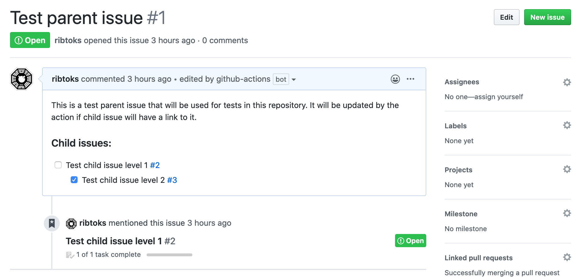

# Update parent issues using GitHub Action

[](https://github.com/ribtoks/parent-issue-action/actions)
[](https://github.com/ribtoks/parent-issue-action/actions)

GitHub Action that updates parent issues that are linked by child issues. When child issue is closed or opened, referenced parent is updated. You can use this to create Epics using GitHub Issues or simply for better tracking of dependent issues. Issue hierarchies are supported too.

## Screenshot



## Usage

Create a workflow file in your `.github/workflows/` directory with the following contents:

### Basic example

```yaml
name: Parent issue workflow
on:
  schedule:
    - cron:  '0 5 * * *'
jobs:
  build:
    runs-on: ubuntu-latest
    steps:
    - uses: actions/checkout@master
    - name: Update parent issues
      uses: ribtoks/parent-issue-update@master
      with:
        TOKEN: ${{ secrets.GITHUB_TOKEN }}
        REPO: ${{ github.repository }}
```

This action was designed to run on schedule instead of per issue update event in order to reduce amount of possible race conditions when multiple issues are updated at once and multiple worflows are started in parallel. Currently GitHub Actions do not support cancelling parallel jobs. When this will be supported, it will be safe to use this action per `issue` `opened`/`reopened`/`closed` trigger.

> **NOTE:** Please note that currently GitHub has 5000 requests per hour limit so if you are running it on a fresh repository and you have lots of todos in comments, you may hit this limit.

### Inputs

| Input                                             | Description                                        |
|------------------------------------------------------|-----------------------------------------------|
| `REPO`  | Repository name in the format of `owner/repo` (required)   |
| `TOKEN`  | Github token used to create or close issues (required)  |
| `DRY_RUN`  | Do not update real real issues (used for debugging) |
| `SYNC_DAYS` | Update parent issues for issue changes in the last `SYNC_DAYS` (defaults to `1`) |
| `MAX_LEVELS` | Keep this deep hierarchy in parent issues (defaults to `0` - unlimited)
| `ADD_CHANGELOG`  | Add a short summary to parent issue with the update changelog |

Flag values like `DRY_RUN` or `ADD_CHANGELOG` use values `1`/`true`/`y` as ON switch.

If you want to run this action every week, you need to update `SYNC_DAYS` to `7` and update cron job schedule in Action syntax to be `0 0 0 * *` (use [crontab guru](https://crontab.guru/) for help).

If you want to sync all issues, use `all` as a value for `SYNC_DAYS`.

### Outputs

| Output                                             | Description                                        |
|------------------------------------------------------|-----------------------------------------------|
| `updatedIssues`  | Equals to `1` if updated any issues    |
